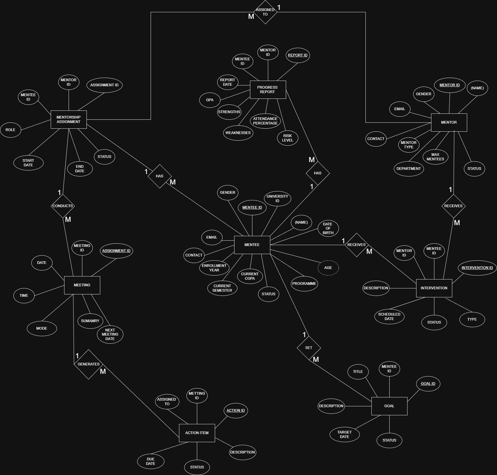

# Mentor–Mentee Academic Monitoring System

A DBMS project built using MySQL to manage mentor-mentee 
relationships, track academic progress, and record interventions.

## 📌 Problem Statement
Educational institutions lack a centralized system to track 
mentoring. This system solves that using a relational database.

## 🗂️ Database Schema
8 tables: `mentor`, `mentee`, `mentorship_assignment`, `meeting`,
`progress_report`, `goal`, `action_item`, `intervention`

## 🔗 Relationships
- Mentor → Mentorship Assignment (1:M)
- Mentee → Mentorship Assignment (1:M)
- Assignment → Meeting (1:M)
- Meeting → Action Item (1:M)
- Mentee → Goal (1:M)
- Mentee → Progress Report (1:M)
- Mentee → Intervention (1:M)

## 📊 ER Diagram

## 🚀 How to Run
1. Open MySQL
2. Run schema first:
   `source sql/schema.sql`
3. Insert sample data:
   `source sql/insert_data.sql`
4. Run queries:
   `source sql/queries.sql`

## 🛠️ Tools Used
- MySQL
- Draw.io (ER Diagrams)

**Contributors**
  - Akashh (https://github.com/Aka-bot2)
  - Chetan (https://github.com/Chetan-37)
